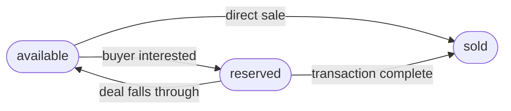

Every listing in TruequeU carries a `status` field that describes its current availability. The type is defined in `src/types.ts`:

```typescript src/types.ts
type ListingStatus = "available" | "reserved" | "sold";
```

## Status definitions

<AccordionGroup>
  <Accordion title="available" defaultOpen>
    The item is visible on the marketplace and open to inquiries. This is the default status when a listing is first created.

    Buyers can browse and open a chat with the seller. The seller can move the item to `reserved` once a buyer has expressed interest, or directly to `sold` when the transaction is complete.
  </Accordion>

  <Accordion title="reserved">
    A buyer has expressed interest and the seller is holding the item for them. The listing remains visible to other users, but it signals that the item is no longer freely available.

    The seller can revert to `available` if the deal falls through, or advance to `sold` once payment and handoff are complete.
  </Accordion>

  <Accordion title="sold">
    The transaction is complete. The item has been handed off and the listing is effectively closed.

    <Warning>
      There is no automated enforcement preventing a status from being set back from `sold` to `available`. This is a manual, trust-based workflow between students.
    </Warning>
  </Accordion>
</AccordionGroup>

---

## Status transition flow



<Note>
  Only the listing owner can update the status. Status changes are made from the listing detail page or the seller's profile.
</Note>

---

## How `updateStatus` works

Status changes are handled by the `updateStatus` action in the Zustand store (`src/store/useStore.ts`):

```typescript src/store/useStore.ts
updateStatus: (id: string, status: Listing['status']) =>
  set((state) => ({
    listings: state.listings.map((l) =>
      l.id === id ? { ...l, status } : l
    ),
  })),
```

The function:

1. Accepts a listing `id` and the new `status` value.
2. Maps over the `listings` array in global state.
3. Returns a new array where the matched listing is updated immutably using spread syntax.
4. All other listings are returned unchanged.

Because `listings` is a persisted field in localStorage (see [Local storage](/reference/local-storage)), the updated status survives page reloads automatically.

---

## Displaying statuses in the UI

The three statuses map to visual indicators in the listing cards and detail views:

| Status | Meaning | Typical badge color |
|---|---|---|
| `available` | Open for purchase | Green |
| `reserved` | On hold for a buyer | Yellow |
| `sold` | Transaction complete | Gray |
